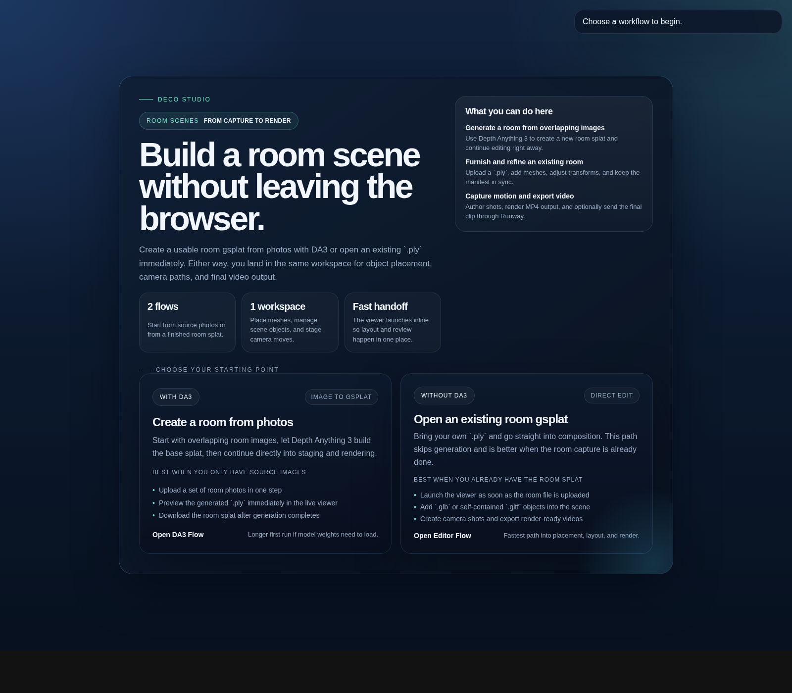
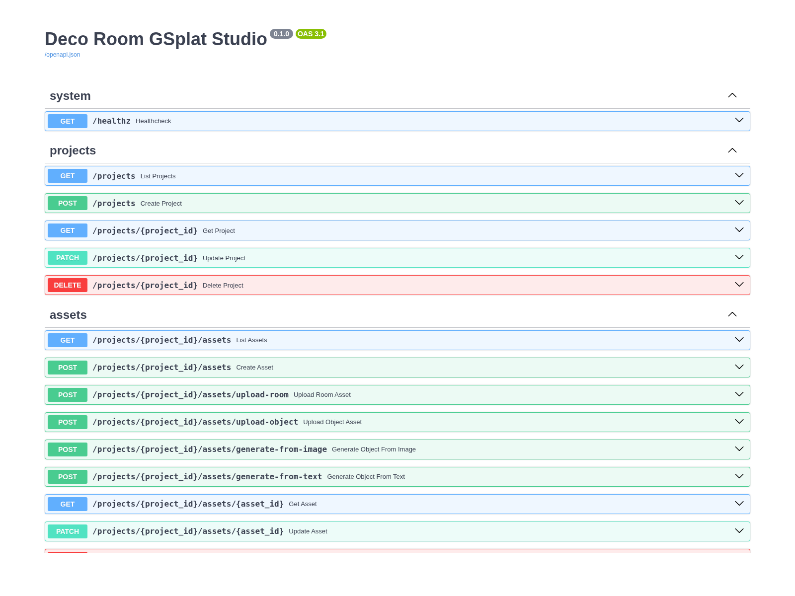

# Deco Room GSplat Studio

Browser-based tooling for turning room photos or existing `gsplat` captures into editable scenes, placing 3D assets, authoring camera moves, and rendering enhanced output through a FastAPI-backed workspace.

## Screenshots

### Editor landing flow



### API docs



## Current Status

Current runnable scope:

- FastAPI backend for project manifests, assets, scene objects, and trajectories
- Two `/editor` entry workflows:
  - create a room `gsplat` from images with Depth Anything 3
  - edit an existing room `gsplat .ply` and render videos
- Dark-themed browser editor at `/editor`
- `viser`-based room viewer launched from the editor
- Mesh object upload and placement for `.glb` and self-contained `.gltf` assets

Not implemented yet:

- Separate frontend app under `apps/web`
- Trajectory editing UI
- Final rendering pipeline

## Installation

Requirements:

- Python 3.9+
- Python 3.10+ is recommended for the optional Depth Anything 3 workflow

From the repository root, create or activate a virtual environment, then install dependencies:

```bash
python -m pip install --upgrade pip
python -m pip install -r requirements.txt
```

Example with `venv`:

```bash
python -m venv .venv
source .venv/bin/activate
python -m pip install --upgrade pip
python -m pip install -r requirements.txt
```

If you are using the same environment as development here, launch `uvicorn` through `python -m uvicorn` so it uses the correct interpreter and installed dependencies.

## Optional Hunyuan3D Integration

This repository now includes a Hunyuan3D-backed generation path for image-to-GLB and text-to-GLB asset creation.

Install the optional runtime like this:

```bash
python -m pip install -r requirements-hunyuan.txt
python -m pip install -e external/Hunyuan3D-2
```

Relevant environment variables:

- `DECO_HUNYUAN_REPO_PATH`
  local checkout path, default `external/Hunyuan3D-2`
- `DECO_HUNYUAN_SHAPE_MODEL`
  shape model id, default `tencent/Hunyuan3D-2`
- `DECO_HUNYUAN_SHAPE_SUBFOLDER`
  shape model subfolder, default `hunyuan3d-dit-v2-0`
- `DECO_HUNYUAN_TEXTURE_MODEL`
  texture model id, default `tencent/Hunyuan3D-2`
- `DECO_HUNYUAN_TEXT2IMAGE_MODEL`
  text-to-image model id, default `Tencent-Hunyuan/HunyuanDiT-v1.1-Diffusers-Distilled`
- `DECO_HUNYUAN_DEVICE`
  device override, default `auto`

Generation endpoints:

- `POST /projects/{project_id}/assets/generate-from-image`
  multipart form upload plus Hunyuan generation params
- `POST /projects/{project_id}/assets/generate-from-text`
  JSON prompt payload plus Hunyuan generation params

This implementation currently guards against CPU-only execution by returning `503` when CUDA is unavailable, because the upstream models are configured for GPU workloads and are not practical on this machine.

## Runway Enhancement

Rendered trajectory videos can now be post-processed with Runway Aleph video-to-video.

Configuration is read from environment variables or the repository-root `.env` file:

- `DECO_RUNWAY_API_KEY`
  Runway API key
- `DECO_RUNWAY_API_VERSION`
  default `2024-11-06`
- `DECO_RUNWAY_VIDEO_MODEL`
  default `gen4_aleph`
- `DECO_RUNWAY_VIDEO_PROMPT`
  prompt used for post-processing
- `DECO_RUNWAY_POLL_INTERVAL_SECONDS`
  task polling interval, default `5`

Render request fields:

- `enhance_with_ai`
  when `true`, the rendered MP4 is uploaded to Runway after local render
- `ai_wait_timeout_seconds`
  how long the API waits for the Runway task before returning a pending status

When enhancement succeeds, the response includes an `enhancement` object with task metadata and an artifact URL for the downloaded enhanced MP4 under the project `renders/` directory.

### Optional: enable image-to-gsplat generation

The new gsplat creation workflow uses Depth Anything 3 from:

- `https://github.com/ByteDance-Seed/Depth-Anything-3`

That stack is intentionally optional because it is heavy and may need a GPU-friendly PyTorch install.

Example conda setup for a CUDA-backed DA3 environment:

```bash
conda create -n deco python=3.10 -y
conda activate deco
conda install nvidia::cuda==12.8.1
python -m pip install --upgrade pip
python -m pip install "torch>=2" torchvision xformers
python -m pip install -r requirements.txt
python -m pip install -r requirements-da3.txt
```

This mirrors the setup used here for DA3 preparation:

- create a Python 3.10+ conda environment
- install CUDA with `conda install nvidia::cuda==12.8.1`
- install `torch`, `torchvision`, and `xformers`
- then install this repository's base and DA3 requirements

Typical setup:

```bash
python -m pip install --upgrade pip
python -m pip install -r requirements.txt
python -m pip install -r requirements-da3.txt
```

Notes:

- First run may download large model weights from Hugging Face.
- If the repo contains a local DA3 checkpoint under `models/` or `model/`, deco will prefer that local directory automatically.
- In this workspace, for example, `model/DA3-GIANT-1.1/` is a valid local DA3 model directory because it contains `config.json` and `model.safetensors`.
- If no local checkpoint is found, the fallback default is `depth-anything/DA3NESTED-GIANT-LARGE-1.1`.
- If you use CUDA, install the matching PyTorch build for your machine before `requirements-da3.txt`.
- The conda + CUDA 12.8.1 + `torch`/`torchvision`/`xformers` sequence above is a documented setup path for users who want the DA3 workflow.
- This repo's current DA3 integration does not require `nerfstudio-project/gsplat`, because we save the predicted gaussians to `.ply` and render that file in our own `viser` viewer.
- `gsplat` is only relevant if you want to use DA3's own gaussian rasterization or `gs_video` rendering path directly.

## Run The App

Start the API server from the repository root:

```bash
python -m uvicorn apps.api.app.main:app --host 0.0.0.0 --port 8000
```

Then open:

- `http://localhost:8000/docs` for the FastAPI docs
- `http://localhost:8000/editor` for the temporary upload-and-view UI

## Editor Flow

The current `/editor` page is a temporary frontend served directly by FastAPI.

Use it like this:

1. Open `/editor`
2. Choose one of the two landing workflows:

`Gsplat creation workflow`

- Drop input images
- Let Depth Anything 3 generate a room splat
- Preview it immediately in the embedded viewer
- Download the generated `.ply` from the workspace header

`Normal gsplat editing and video rendering workflow`

- Drop an existing room `gsplat .ply`
- Let the viewer launch automatically
- Add meshes and place them interactively
- Create shots, capture keyframes, and render MP4 output

Once the viewer is open, newly placed objects are synced into the active scene without relaunching it.

In either workflow:

- mesh uploads support `.glb` and self-contained `.gltf`
- newly added meshes appear in the live viewer without reloading it
- clicking a mesh in the viewer reveals interactive move and rotate gizmos
- the generated or uploaded room splat can be downloaded from the workspace header

`.gltf` uploads currently need to be self-contained. External `.bin` buffers or texture files are not copied into the project yet.

The `viser` viewer runs on port `8080` by default.

## Environment Variables

Optional configuration:

- `DECO_PROJECTS_ROOT`
  path for stored projects and uploaded assets
- `DECO_VIEWER_HOST`
  bind host for the `viser` server, default `0.0.0.0`
- `DECO_VIEWER_PORT`
  port for the `viser` server, default `8080`
- `DECO_VIEWER_PUBLIC_HOST`
  host used in the browser iframe URL, default `localhost`
- `DECO_DA3_MODEL`
  Depth Anything 3 model identifier or local model path. If omitted, deco first looks for a local checkpoint under repo `models/` or `model/`, then falls back to `depth-anything/DA3NESTED-GIANT-LARGE-1.1`
- `DECO_DA3_DEVICE`
  DA3 device selection, default `auto`
- `DECO_DA3_PROCESS_RES`
  DA3 inference resolution, default `504`

Example:

```bash
DECO_PROJECTS_ROOT=./projects \
DECO_VIEWER_HOST=0.0.0.0 \
DECO_VIEWER_PORT=8080 \
DECO_VIEWER_PUBLIC_HOST=localhost \
DECO_DA3_MODEL=./model/DA3-GIANT-1.1 \
DECO_DA3_DEVICE=auto \
DECO_DA3_PROCESS_RES=504 \
python -m uvicorn apps.api.app.main:app --host 0.0.0.0 --port 8000
```

## Run Tests

This environment has a broken globally installed Hydra pytest plugin, so tests should be run with plugin autoload disabled:

```bash
PYTHONPATH=. PYTEST_DISABLE_PLUGIN_AUTOLOAD=1 python -m pytest apps/api/tests -q
```

## Repository Layout

- `apps/api` FastAPI application and orchestration layer
- `apps/web` Web frontend for scene editing, trajectories, and job monitoring
- `services` Python domain packages for scene state, assets, rendering, jobs, and storage
- `services/generation` Optional image-to-gsplat adapters, including Depth Anything 3 integration
- `projects` Local project and artifact storage
- `configs` Runtime and model configuration templates
- `scripts` Development and worker entrypoints
- `docs` Architecture and API notes
- `tests` Integration and end-to-end coverage
