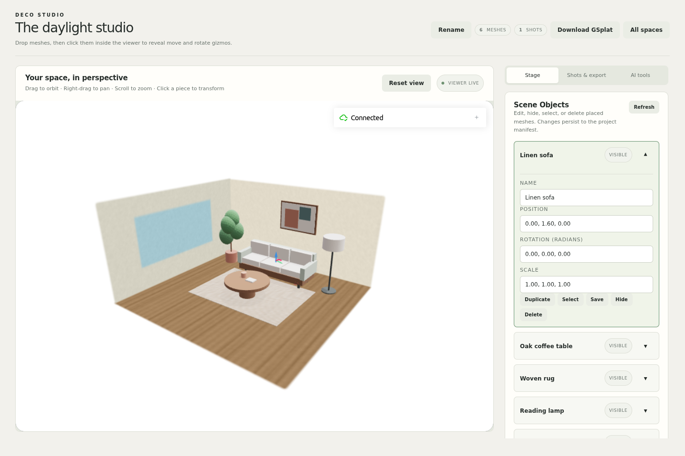
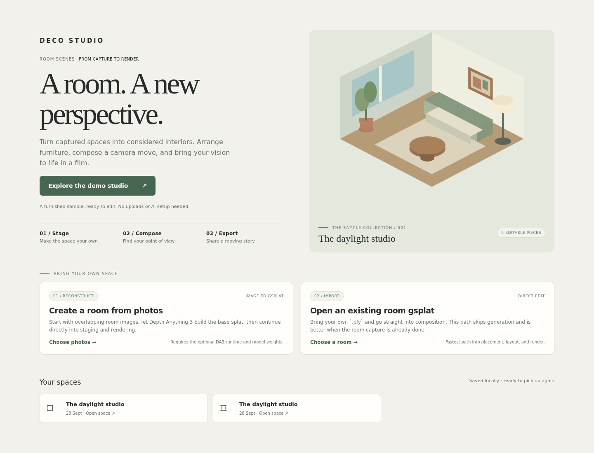
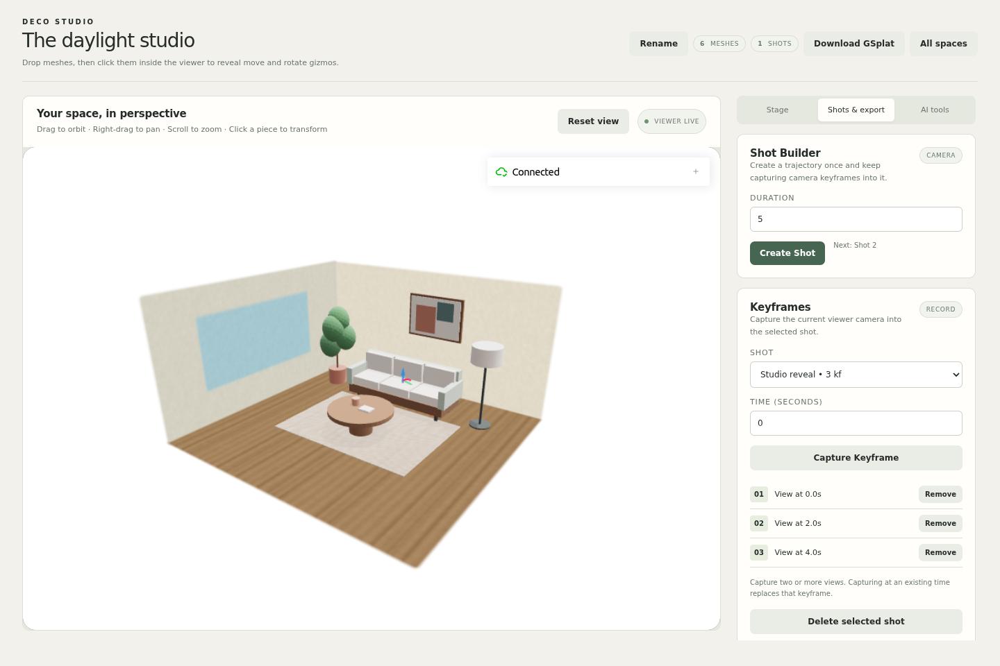
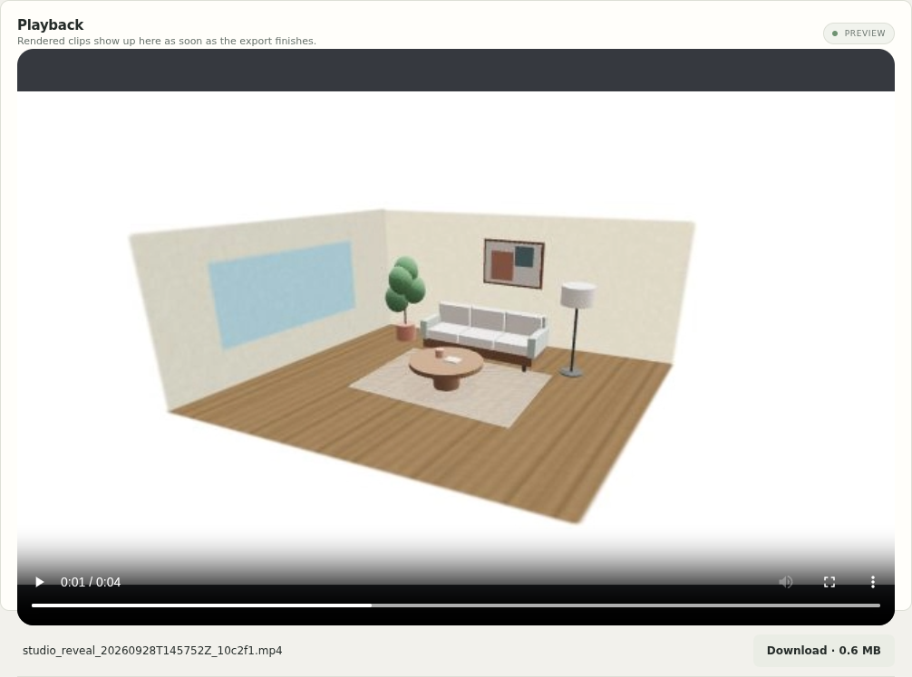

<div align="center">

# Deco Studio

**A room. A new perspective.**

Turn captured spaces into editable interiors.<br>
Arrange furniture, compose a camera move, and export a film from your browser.


[Quick start](#quick-start) · [The workflow](#the-workflow) · [AI integrations](#optional-ai-integrations) · [Documentation](#documentation)

</div>



<p align="center"><sub>The daylight studio: a procedural Gaussian-splat room with six separate, editable GLB objects.</sub></p>

## From space to story

| Stage the room | Compose the camera | Share the result |
| --- | --- | --- |
| Import a room splat, add furniture, and adjust position, rotation, and scale. | Capture viewpoints, build a timed camera path, and refine keyframes. | Render an MP4, play it back, and download it. Reopen the project whenever you need it. |

- **A demo ready to open.** One click creates a furnished sample and a four-second camera move.
- **A workspace that remembers.** Projects, object edits, camera shots, and completed exports persist locally.
- **Real 3D assets.** Import Gaussian-splat PLY rooms and GLB or self-contained GLTF objects.
- **Optional AI at each stage.** Reconstruct rooms with DA3, generate furniture with Astra or Hunyuan, and enhance films with Runway.

## Quick start

Use **Python 3.11** and a browser with WebGL enabled. The sample, editor, and local video export need no AI model downloads or API keys.

```bash
git clone https://github.com/preimage-ai/deco.git
cd deco
./scripts/install.sh --python python3.11 --venv .venv
./scripts/demo.sh
```

Open **[localhost:8000/editor](http://localhost:8000/editor)** → **Explore the demo studio**.

The API runs on port `8000`; the embedded viewer uses `8080`. To use different ports:

```bash
DECO_PORT=8765 DECO_VIEWER_PORT=8088 ./scripts/demo.sh
```

> **Presenting it?** Follow the [three-minute demo walkthrough](docs/demo-walkthrough.md). Keep one editing tab active: the local runtime has one shared viewer scene.

## The workflow

<table>
<tr>
<td width="50%"></td>
<td width="50%"></td>
</tr>
<tr>
<td><strong>Start with a space.</strong><br>Explore the sample, import a captured room, or reconstruct one from overlapping photos.</td>
<td><strong>Find your perspective.</strong><br>Stage the furniture and save camera views along a timed shot.</td>
</tr>
</table>

1. **Open a room.** Choose the sample, upload a Gaussian-splat `.ply`, or use the optional photo reconstruction flow.
2. **Make it yours.** Upload or generate furniture. Move pieces with the viewer gizmo or enter exact transforms. Duplicate, hide, or remove objects as you compose.
3. **Build a shot.** Capture at least two camera views at distinct times. The sample includes a prepared **Studio reveal**.
4. **Export the film.** Open **Shots & export**, choose a shot, and click **Render MP4**. Keep the viewer connected and the tab active until rendering finishes.
5. **Pick up later.** Play or download completed clips, reload the editor, or browse saved projects under **All spaces**.

<details>
<summary><strong>See the exported demo in the playback panel</strong></summary>



The screenshots show the running application and an actual local MP4 export. The sample room is procedural geometry; it is not presented as an AI reconstruction.

</details>

## Optional AI integrations

The base demo works independently of these providers. Enable the ones you need.

| Capability | Integration | What to expect | Setup |
| --- | --- | --- | --- |
| Text or reference image → simple furniture | **GPT-6 Astra** | Validated geometry recipes become colored, untextured GLBs locally. Useful for approximate furniture. | Server-side `OPENAI_API_KEY`; no local GPU required |
| Image → detailed object | **Hunyuan3D 2.0** | Shape generation with optional texture generation | Optional Hunyuan runtime, model weights, and working CUDA |
| Text → detailed object | **HunyuanDiT → Hunyuan3D** | A generated reference image feeds the mesh pipeline | Hunyuan stack plus the text-to-image model |
| Overlapping photos → room splat | **Depth Anything 3** | Reconstruct a room from an image set | Optional DA3 runtime and a Gaussian-capable checkpoint |
| Rendered video → enhanced video | **Runway Aleph** | Creative video editing with `aleph2` or `gen4_aleph` | Runway API key and model access |

Add credentials to your local, ignored `.env` file and restart the server. Astra uses a billed API and sends uploaded reference images to OpenAI. Its output is a procedural approximation; it does not provide detailed textured reconstruction. Video enhancement can change visual details, so retain the raw render.

**[Read the complete AI integration guide →](docs/ai-integrations.md)**

It covers installation, GPU requirements, API examples, model choices, room-video capture, and the improvement roadmap. For room video, the current in-app reconstruction accepts extracted frames; you can also import a Gaussian PLY produced by an external reconstruction workflow.

<details>
<summary><strong>Optional installation commands</strong></summary>

```bash
# Add one or both optional local model runtimes.
./scripts/install.sh --python python3.11 --venv .venv --with-hunyuan --with-da3
```

The flags install `requirements-hunyuan.txt` and `requirements-da3.txt`. They do not configure the host NVIDIA driver or certify model readiness. For GPU development, the [integration guide](docs/ai-integrations.md) recommends separate environments and explains native texture-extension builds.

Use `--hunyuan-repo /path/to/Hunyuan3D-2` only to opt into a compatible local source checkout. The default sources are pip packages and Hugging Face model IDs.

</details>

## Under the hood

```text
Browser editor ── FastAPI ── Local project store
                       ├── Viser: live room + object interaction
                       ├── Camera trajectories → MP4 rendering
                       └── Optional Astra / Hunyuan / DA3 / Runway
```

| Location | Responsibility |
| --- | --- |
| [`apps/web/`](apps/web) | Editor HTML, styling, and browser interactions |
| [`apps/api/`](apps/api) | API routes, dependency wiring, orchestration, and tests |
| [`services/`](services) | Asset ingest, generation, scene state, rendering, and storage |
| `projects/` | Local manifests and generated artifacts; excluded from Git |
| [`scripts/`](scripts) | Installation, demo launcher, and browser smoke test |
| [`docs/`](docs) | Setup guides, architecture, API contract, and roadmap |

<details>
<summary><strong>Configuration reference</strong></summary>

Application settings are read from environment variables or the repository's `.env`; launcher options such as `DECO_PORT`, `DECO_HOST`, and `DECO_PYTHON` use shell environment variables. Restart after changes. Preserve the `projects/` directory to retain saved work.

| Setting | Default / purpose |
| --- | --- |
| `DECO_PROJECTS_ROOT` | `projects` |
| `DECO_PORT` | `8000` — demo launcher API port |
| `DECO_HOST` | `127.0.0.1` — demo launcher API host |
| `DECO_VIEWER_PORT` | `8080` |
| `DECO_VIEWER_HOST` | Launcher: `127.0.0.1`; direct API startup: `0.0.0.0` |
| `DECO_VIEWER_PUBLIC_HOST` | `localhost` |
| `DECO_PYTHON` | Demo launcher interpreter; defaults to `.venv/bin/python` |
| `DECO_OPENAI_API_KEY` / `OPENAI_API_KEY` | Astra credentials; `DECO_OPENAI_API_KEY` takes precedence |
| `DECO_DA3_MODEL` | `depth-anything/DA3NESTED-GIANT-LARGE-1.1`, or an explicit local model path |
| `DECO_DA3_DEVICE` / `DECO_DA3_PROCESS_RES` | `auto` / `504` |
| `DECO_HUNYUAN_REPO_PATH` | Optional local runtime checkout |
| `DECO_HUNYUAN_SHAPE_MODEL` | `tencent/Hunyuan3D-2` |
| `DECO_HUNYUAN_SHAPE_SUBFOLDER` | `hunyuan3d-dit-v2-0` |
| `DECO_HUNYUAN_TEXTURE_MODEL` | `tencent/Hunyuan3D-2` |
| `DECO_HUNYUAN_TEXT2IMAGE_MODEL` | `Tencent-Hunyuan/HunyuanDiT-v1.1-Diffusers-Distilled` |
| `DECO_HUNYUAN_DEVICE` | `auto` |
| `DECO_RUNWAY_API_KEY` | Runway credentials; falls back to `RUNWAYML_API_SECRET` |
| `DECO_RUNWAY_VIDEO_MODEL` | `gen4_aleph`; set `aleph2` to use Aleph 2 |
| `DECO_RUNWAY_API_VERSION` | `2024-11-06` |
| `DECO_RUNWAY_VIDEO_PROMPT` | Override the default enhancement prompt |
| `DECO_RUNWAY_POLL_INTERVAL_SECONDS` | `5` |

For direct API startup:

```bash
.venv/bin/python -m uvicorn apps.api.app.main:app --host 127.0.0.1 --port 8000
```

</details>

## Development

```bash
.venv/bin/python -m pip install -r requirements-dev.txt
PYTHONPATH=. PYTEST_DISABLE_PLUGIN_AUTOLOAD=1 .venv/bin/python -m pytest apps/api/tests -q
```

With the demo running, exercise the real browser workflow:

```bash
.venv/bin/python scripts/smoke_demo.py --url http://localhost:8000
```

The smoke test creates a sample, edits furniture, checks persistence, exports and plays a real MP4, and checks the mobile layout. It uses installed Google Chrome, or Playwright Chromium after `.venv/bin/python -m playwright install chromium`. Output goes to `/tmp/deco-browser-check`.

## Documentation

| Guide | Start here for… |
| --- | --- |
| [Demo walkthrough](docs/demo-walkthrough.md) | Presenting the project in three minutes |
| [AI integrations](docs/ai-integrations.md) | Provider setup, examples, model choices, and room-video recommendations |
| [API contract](docs/api-contract.md) | Projects, assets, scenes, trajectories, and renders |
| [Architecture](docs/architecture.md) | How the application fits together |
| [Scene format](docs/scene-format.md) | Stored scene and manifest structure |
| [Roadmap](docs/roadmap.md) | Implemented scope and remaining work |
| [Interactive API docs](http://localhost:8000/docs) | Trying endpoints while the server is running |

## Current boundaries

Deco is a local demo with a shared viewer, not an authenticated multi-user deployment. Gaussian-splat rooms require the expected Gaussian fields; generic point-cloud PLYs are insufficient. GLTF uploads must be self-contained, and existing furniture in a captured splat remains part of that capture.

The provider controls report package or credential availability. Live AI output depends on your account, model access, and hardware. See the [integration guide's validation status](docs/ai-integrations.md#6-troubleshooting-and-validation-status) for what has been tested.
